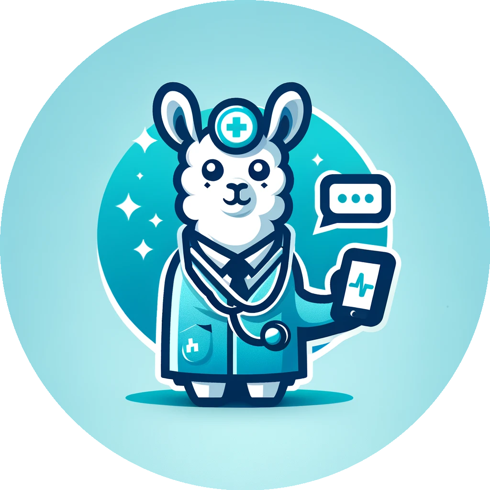

# "Chat-Doc": Fine-tuning Llama 2 for a medical chat-app




<a href="https://github.com/psf/black"></a>


> Author: `Tilman Kerl` <br/>
> Project Type: `Bring your own data`  <br/>
> Domain `Natural Language Processing`

This project is being implemented in context of the course "Applied Deep Learning" at the Technical University of Vienna.
The goal of this specific project is to fine-tune Llama2 model for a medical chat-application, a "Chat-Doc".

> If you want to read more about the 'DELIVER' part of this projext, please see [DELIVER.md](htpps://github.com/MisterXY89/blob/main/DELIVER.md) or the `chat_doc/app/` folder.
>
> If you want to read more about the of 'HACKING' part of this project, please see [HACKING.md](https://github.com/MisterXY89/chat-doc/blob/main/HACKING.md).
>
> If you want to read the proposal of this project, please see [INITIATE.md](https://github.com/MisterXY89/chat-doc/blob/main/INITIATE.md).

## Project Overview
The ChatDoc project aims to deploy a medical chatbot application that assists users in assessing their medical symptoms and provides reliable recommendations. The chatbot is powered by the Llama2 model, fine-tuned for medical NLP tasks using the QLoRA technique.

<!-- architecture img  -->


## Getting Started

### From the HuggingFace Model Hub
The final model is available on [HuggingFace](https://huggingface.co/MisterXY89/chat-doctor).
Write me a message if you want to get access to the model.

Once you are approved, you can use the huggingface library to load the model.
> **NOTE**: The model needs a GPU to run, minimum 24GB of GPU memory.
```python
from transformers import pipeline

pipe = pipeline("text-generation", model="MisterXY89/chat-doctor")

pipe("Hi, I feel dizzy and have a headache for a few days already. Should I go the doctor?")
```

### Reproduce the Results and run the CLI
To use the ChatDoc application, follow the steps below:
1. Clone the Repository:
```bash
git clone https://github.com/MisterXY89/chat-doc.git
cd chat-doc
```

2. Install Dependencies (during dev I used conda):
```bash
# conda
conda env create -f environment.yml
conda activate chat-doc
```

3. (Set up pre-commit hooks:)
```bash
pre-commit install
```

1. Rename the `.env.example` file to `.env` and fill in your credentials.
```bash
# assuming you are in the root folder of the project
mv chat_doc/.env.example chat_doc/.env
nano chat_doc/.env
```

1. Generate Data:
To generate data for the chatbot, use the following command:
```bash
python pipe.py generate --dataset dialogue-full
```
Replace dataset name with one of: `"pmc", "icd", "diagnose", "med-dialogue", "dialogue-full", "full"`.

1. Train the Model:
   Training is done on AWS SageMaker, you can use the CLI to start the training:
```bash
python pipe.py train --dataset xxx --model xxx
```

Replace dataset name with one of: `"pmc", "icd", "diagnose", "med-dialogue", "dialogue-full", "full"`,
model can be any llama2 model from the [huggingface model hub](https://huggingface.co/meta-llama).

Alternativly, you can use the `sage_maker_training.ipynb` notebook and configure the training job there.

6. Start the Web-App:
```bash
python pipe.py run-app
```

## Training Results
The first training results are stored in the [logs](./logs) folder and visualized below:


## Running the Web-App
To run the web-app, first install the dependencies (assuming python-related libraries are already installed):
```bash
npm i
```

then run the following command:
```bash
python pipe.py run-app
```

## Local Development

### Install Dependencies
```bash
# ui dependencies
npm i

# all python dependencies (incl. ML dependencies)
conda env create -f environment.yml
conda activate chat-doc
```

### Set up pre-commit hooks:
See above

### Start Server & tailwindcss
```bash
python cli.py run-app --debug True
```
and in a separate terminal:
```bash
# tracks changes in the tailwindcss input file and compiles it to the output file
npx tailwindcss -i ./chat_doc/app/static/src/input.css -o ./chat_doc/app/static/dist/css/output.css --watch
```

## Run tests
To run the tests, run the following command:
```bash
python -m pytest test
```

## Project Structure
```
- pipe.py                  # Main pipeline script for data generation and model training.
- chat_doc/                 # Contains project conf, logging setup, training, and dataset generation
    - data_generation/
    - training/
    - inference/
- data/                     # Contains the raw data and the generated data.
- model/                    # Stores the trained model
```


## References
See also the [references.bib](./references.bib) file.

[1] Harrison, James E et al. “ICD-11: an international classification of diseases for the twenty-first century.” BMC medical informatics and decision making vol. 21,Suppl 6 206. 9 Nov. 2021, doi:10.1186/s12911-021-01534-6

[2] Dettmers, Tim, et al. "Qlora: Efficient finetuning of quantized llms." arXiv preprint arXiv:2305.14314 (2023).

[3] Touvron, Hugo, et al. "Llama 2: Open foundation and fine-tuned chat models." arXiv preprint arXiv:2307.09288 (2023).

[4] Wolf, Thomas, et al. "Transformers: State-of-the-art natural language processing." Proceedings of the 2020 conference on empirical methods in natural language processing: system demonstrations (2020).

[5] Mangrulkar, Sourab et al. "PEFT: State-of-the-art Parameter-Efficient Fine-Tuning methods" https://github.com/huggingface/peft (2022).

[6] Gugger, Sylvain, et al. "Accelerate: Training and inference at scale made simple, efficient and adaptable" https://github.com/huggingface/accelerate (2022).

## License
This project is licensed under the terms of the MIT license. See [LICENSE](./LICENSE) for more details.
