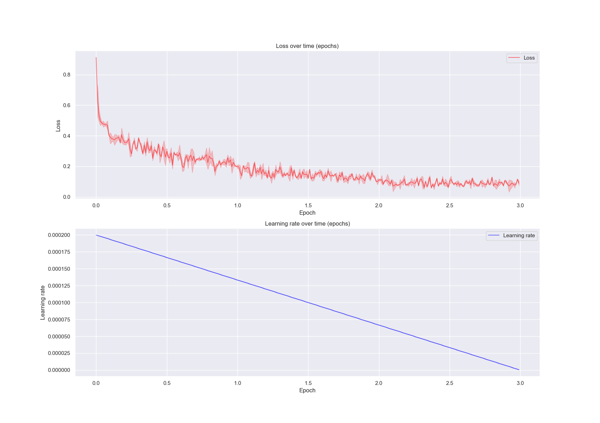

# "Chat-Doc": Fine-tuning Llama2 for a medical chat-app


<a href="https://github.com/psf/black"></a>

> Author: `Tilman Kerl` <br>
> Project Type: `Bring your own data` <br>
> Domain `Natural Language Processing`

This project is being implemented in context of the course "Applied Deep Learning" at the Technical University of Vienna.
The goal of this specific project is to fine-tune Llama2 model for a medical chat-application, a "Chat-Doc".

> If you want to read the proposal of this project, please see [INITIATE.md](https://github.com/MisterXY89/chat-doc/blob/main/INITIATE.md).

## Project Overview
The ChatDoc project aims to deploy a medical chatbot application that assists users in assessing their medical symptoms and provides reliable recommendations. The chatbot is powered by the Llama2 model, fine-tuned for medical NLP tasks using the QLoRA technique.

## Getting Started
To use the ChatDoc application, follow the steps below:
1. Clone the Repository:
```bash
git clone https://github.com/MisterXY89/chat-doc.git
cd chat-doc
```

2. Install Dependencies (during dev I used conda):
```bash
# conda
conda env create -f environment.yml
conda activate chat-doc
```

3. Set up pre-commit hooks:
```bash
pre-commit install
```

4. Generate Data:
To generate data for the chatbot, use the following command:
```bash
python pipe.py generate --dataset dialogue-full
```
Replace dataset name with one of: `"pmc", "icd", "diagnose", "med-dialogue", "dialogue-full", "full"`.

5. Train the Model:
```bash
python pipe.py train --dataset xxx --model xxx
```
Replace dataset name with one of: `"pmc", "icd", "diagnose", "med-dialogue", "dialogue-full", "full"`,
model can be any llama2 model from the [huggingface model hub](https://huggingface.co/meta-llama).

## Training Results
The first training results are stored in the [logs](./logs) folder and visualized below:


## Run tests
To run the tests, run the following command:
```bash
python -m pytest test
```

## Project Structure
```
- pipe.py                  # Main pipeline script for data generation and model training.
- chat_doc/                 # Contains project conf, logging setup, training, and dataset generation
    - data_generation/
    - training/
    - inference/
- data/                     # Contains the raw data and the generated data.
- model/                    # Stores the trained model
```


## References
See also the [references.bib](./references.bib) file.

[1] Harrison, James E et al. “ICD-11: an international classification of diseases for the twenty-first century.” BMC medical informatics and decision making vol. 21,Suppl 6 206. 9 Nov. 2021, doi:10.1186/s12911-021-01534-6

[2] Dettmers, Tim, et al. "Qlora: Efficient finetuning of quantized llms." arXiv preprint arXiv:2305.14314 (2023).

[3] Touvron, Hugo, et al. "Llama 2: Open foundation and fine-tuned chat models." arXiv preprint arXiv:2307.09288 (2023).

[4] Wolf, Thomas, et al. "Transformers: State-of-the-art natural language processing." Proceedings of the 2020 conference on empirical methods in natural language processing: system demonstrations (2020).

[5] Mangrulkar, Sourab et al. "PEFT: State-of-the-art Parameter-Efficient Fine-Tuning methods" https://github.com/huggingface/peft (2022).

[6] Gugger, Sylvain, et al. "Accelerate: Training and inference at scale made simple, efficient and adaptable" https://github.com/huggingface/accelerate (2022).

## License
This project is licensed under the terms of the MIT license. See [LICENSE](./LICENSE) for more details.
